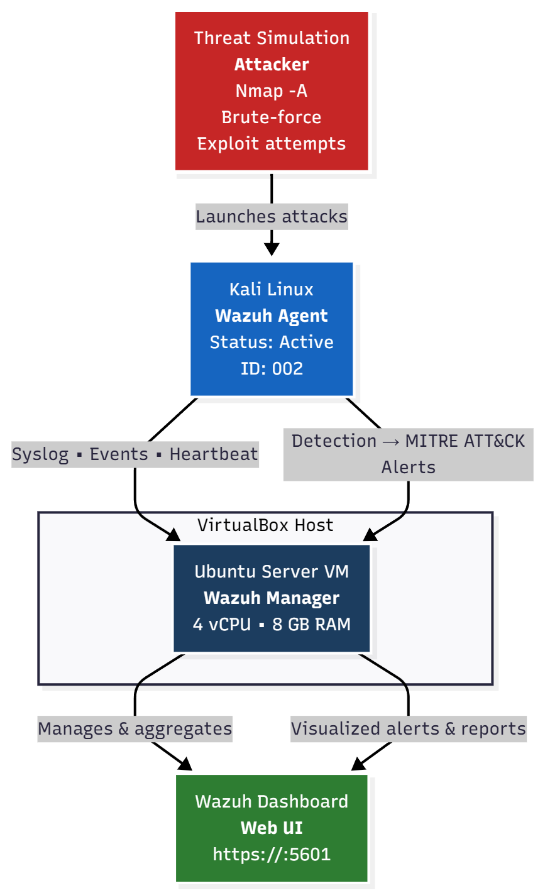
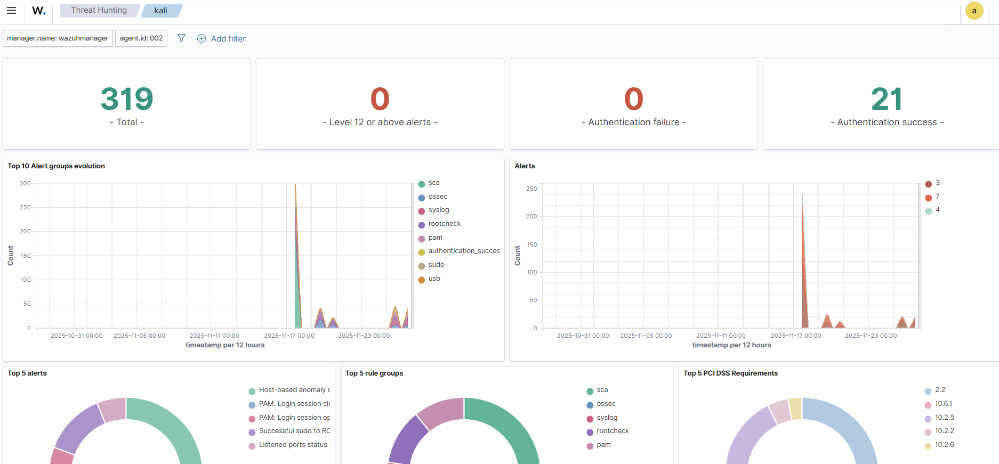
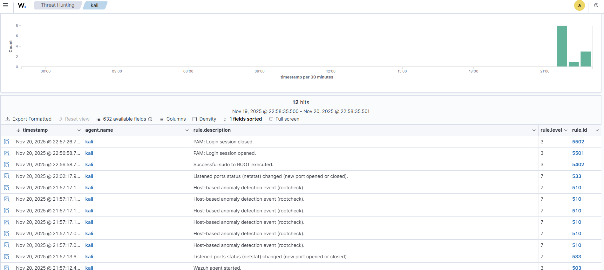
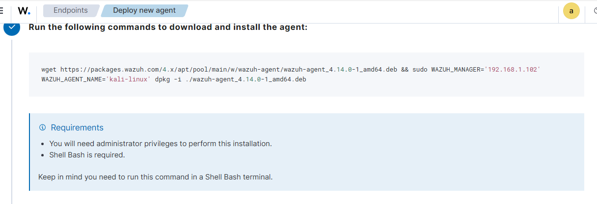

# Enterprise Security Monitoring & Threat Detection Laboratory

   

---

## 📋 Project Overview

This project demonstrates enterprise-grade Security Information and Event Management (SIEM) capabilities through a comprehensive homelab environment. Built from scratch using **Wazuh**, this lab showcases threat detection, security monitoring, log analysis, and incident response skills essential for SOC analyst and security engineering roles.

The objective was to engineer a pipeline that ingests logs, detects anomalies, and maps real-world attacks to the **MITRE ATT&CK Framework**.

---

## 🏗️ Architecture




### The Infrastructure

- **SIEM Core:** Wazuh Manager (Ubuntu Server 25.10) - *Log aggregation & Correlation*

- **Endpoint/Target:** Kali Linux 2024.x - *Attacker & Monitored Agent*

- **Virtualization:** Oracle VirtualBox - *Bridged Networking for full LAN visibility*

---

## ⚙️ Configuration & Engineering

This project mimics a production environment while optimized for rapid testing. Below are the core configuration details utilized.

### 1. Manager Configuration (`ossec.conf`)

- **Location:** `/var/ossec/etc/ossec.conf`

- **Alert Level:** Set to `3` (Medium severity and above logged) to reduce noise.

- **File Integrity Monitoring (FIM):**
  - **Real-time Monitoring:** Enabled for critical paths.
  - **Scan Frequency:** Adjusted to `1800` seconds (30 mins) for rapid lab testing.
  - **Target Directories:** `/etc`, `/usr/bin`, `/sbin`, `/boot` (High-value targets for persistence).

### 2. Agent Configuration (`kali-agent.conf`)

- **Location:** `/var/ossec/etc/ossec.conf` (on Kali Agent)

- **Log Forwarding:** Captures authentication logs (`/var/log/auth.log`) and system logs (`syslog`).

- **System Inventory:** Enabled to track hardware, OS, network, and process changes on the endpoint.

### 3. Implementation Logic

- **Deployment:** All-in-one installation script for Manager; HTTP file server delivery for Agent (to bypass initial network isolation issues).

- **Active Response:** Intentionally **disabled** for this lab to allow full execution of attack chains without automatic blocking, ensuring complete log data capture.

---

## 🛠️ Methodology: Manual Command Execution

**Why Manual Commands Instead of Automated Scripts?**

While automation (Ansible/Bash) is valuable, this project focuses on demonstrating **hands-on command-line proficiency** and the manual investigation workflows used by SOC analysts.

**This approach demonstrates:**

- ✅ **Deep Understanding:** Proficiency with command syntax, parameters, and environment variables.

- ✅ **Real-time Troubleshooting:** ability to adapt when services fail (e.g., debugging `systemctl` or permission errors manually).

- ✅ **Tool Mastery:** Direct usage of `Hydra` for attacks and standard Linux utilities for system modification.

- ✅ **Analyst Workflow:** Simulating the manual "hunt" rather than relying on pre-canned scripts.

*(See **`configurations/commands-used.md`** for key executed commands)*

---

## 🚀 Project Phases & Attack Simulation

### Phase 1: Infrastructure Design

Established the "Defense" zone. Migrated storage from external HDD to internal SSD to resolve I/O bottlenecks and configured Bridged Adapters to allow VM-to-VM communication.

### Phase 2: Agent Deployment

Established the "Target" zone. Deployed the Wazuh Agent to Kali Linux and verified encrypted connectivity (TCP 1514) to the Manager.

### Phase 3: Threat Detection (MITRE ATT&CK)

Executed live attacks to validate SIEM rules.

#### 📊 Detection Capabilities Validated

| Attack Type | Tool Used | MITRE ID | Wazuh Rule ID | Status |
| --- | --- | --- | --- | --- |
| **SSH Brute Force** | Hydra | **T1110** | `5710`, `5712`, `5720` | ✅ Detected |
| **Persistence (Cron)** | Crontab | **T1053.003** | `550` (FIM) | ✅ Detected |
| **Privilege Escalation** | Sudo | **T1548** | `5401`, `5402` | ✅ Detected |
| **System Modification** | Systemd | **T1543.002** | `554` | ✅ Detected |

---

## 📸 Proof of Concept (Gallery)

### 1. The Dashboard (Security Overview)

 *A unified view of security events, agents, and system health.*

### 2. Attack Detection (Brute Force/Persistence)

 *Wazuh correctly correlating multiple failed login attempts or unauthorized file changes into a high-severity alert.*

### 3. Agent Deployment Success

 *Confirmation of successful agent enrollment and active status on the Kali Linux endpoint.*

---

## 📂 Repository Structure

```markdown
SIEM-Homelab-Project-V2/
├── Assets/ # Visual evidence 
│   └── Screenshots/
├── Code/ # Configuration backups
│   ├── ossec.conf # Manager config backup
│   ├── kali-agent.conf # Agent config backup
│   └── commands-used.md # Key manual commands executed
├── Documentation/ # Deep dives and logs
│   ├── Attack_Scenarios # Detailed attack walkthroughs
│   └── Troubleshooting # Comprehensive error logs & fixes
└── README.md # Project Overview (This file)
```

---

## 💡 Key Takeaways & Professional Value

- **Configuration Management:** Experience balancing "secure by default" settings with the need for custom tuning (e.g., FIM frequency).

- **Detection Engineering:** Validated that default rulesets require tuning to avoid false positives/negatives.

- **Resilience:** The ability to troubleshoot complex infrastructure issues (Storage I/O, Network Bridging) is as critical as understanding the security tools themselves.

---

## 🤝 Contact

**LinkedIn:** [Trevon Swift](https://linkedin.com/in/trevon-swift-35477b65) 

**Portfolio:** [Trevon Swift](https://trevcyber-nw8mwnbm.manus.space/?code=SircLTT4QZepKyYWiSEdYd)  

**Repository:** [SIEM-Homelab-Project-V2](https://github.com/Trevon-Swift/SIEM-Homelab-Project-V2)

**Email:** [Trevon Swift](https://trevon.swift@protonmail.com)
